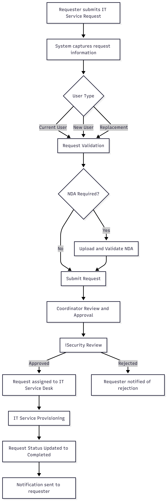
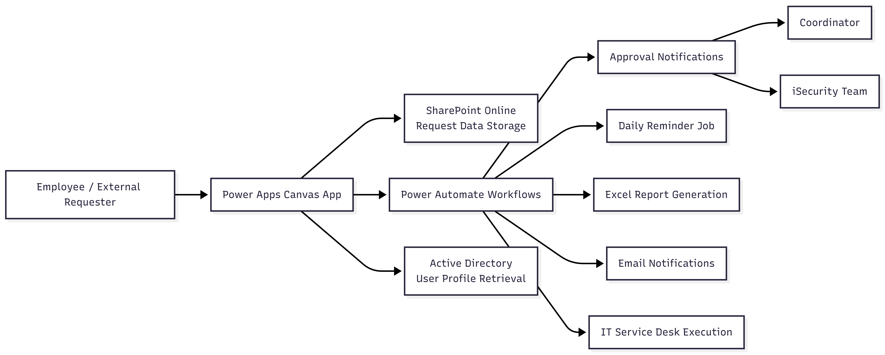
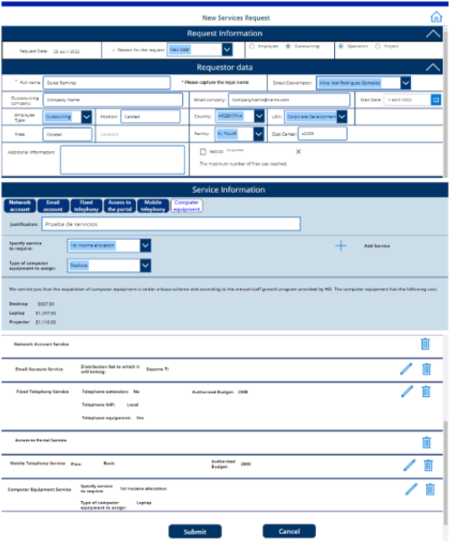
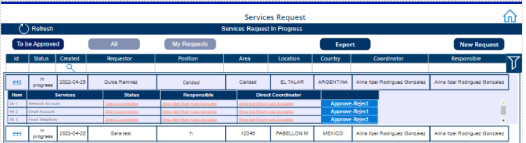
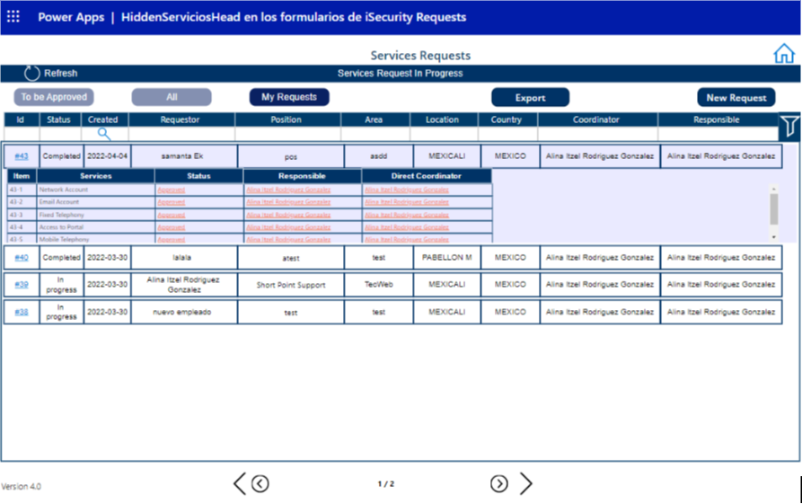

# IT Service Request & Provisioning System

## Project Overview

The IT Services Request & Provisioning System is a centralized business process automation solution designed to manage internal IT service requests such as network accounts, email access, and computer equipment provisioning.

The system enables employees and external personnel (outsourcing staff) to formally submit service requests through a structured workflow that includes validation, multi-level approvals, and execution by the IT Service Desk team.

Built using Microsoft Power Platform, the solution digitizes the entire lifecycle of IT service provisioning, improving transparency, compliance, and operational efficiency.

---

## Process Scope

The system manages the lifecycle of internal IT service provisioning requests, including:

- Network and system account provisioning
- Email access requests
- Computer equipment allocation
- Replacement or reassignment of employee access
- Security validation for external personnel

The solution supports requests for both internal employees and external contractors across multiple organizational units.

---

## Business Problem

Prior to the implementation of this solution, IT service requests were handled through fragmented communication channels and manual coordination.

This resulted in several operational challenges:

- **Lack of traceability:** Difficulty tracking request status and responsible stakeholders.
- **Security risks:** Informal processes for handling sensitive documentation such as Non-Disclosure Agreements (NDAs).
- **Process bottlenecks:** Delays in onboarding new employees or replacing existing personnel due to missing notifications to approvers.
- **Limited visibility:** IT teams lacked centralized oversight of pending and completed service requests.

These issues increased operational risk and slowed down employee onboarding and IT service delivery.

---

## Solution Overview

A Power Apps application integrated with the Microsoft 365 ecosystem was developed to provide a centralized platform for IT service request management.

The solution digitalizes the full request lifecycle, starting from request submission based on the type of user:

- Current User
- New User
- Replacement

Requests are then routed through an automated approval workflow involving coordinators, the Information Security team, and the IT Service Desk.

The system ensures that all necessary validations, documentation requirements, and approvals are completed before provisioning IT services.

The system follows a structured service request lifecycle that includes request validation, document verification, multi-level approval, and IT service provisioning.

---

## Process Flow

The following diagram illustrates the automated lifecycle of an IT service request, from submission to final service provisioning.

---

## Key Features

- **Dynamic request forms** that adapt based on the request reason and user type.
- **Document management capability** for mandatory NDA uploads for external personnel outside Mexico.
- **Approval center interface** allowing coordinators and security personnel to approve or reject individual request items.
- **Centralized service request repository** for improved visibility and tracking.
- **Reporting capability** allowing users to export historical request data to Excel via email.

---

## Process Automation

The solution automates the full lifecycle of IT service provisioning requests.

### Automated Workflow

1. A requester submits an IT service request through the application.
2. The system captures the request details and categorizes the request based on user type.
3. The request enters a **multi-level approval workflow** involving coordinators and the Information Security team.
4. Required documents such as NDAs are validated.
5. Once approved, the request is routed to the **IT Service Desk** for execution.
6. The system updates the request status throughout the process.
7. Once the service is completed, the request is marked as **Completed** and stored for historical tracking.

### Automated Capabilities

- **Multi-level approval workflow**
- **Automated status updates** (In Progress, In Review, Completed)
- **Email notifications** at key process stages
- **Scheduled reminder notifications** sent daily at 5 AM for pending approvals

---

## Solution Architecture

The solution was built using Microsoft Power Platform integrated with Microsoft 365 services to automate the IT service request lifecycle.

----

## Application Screenshots

### Service Request Form

The request form dynamically adapts based on the type of user and requested services.

---

### Approval Center

Coordinators and security personnel can review and approve individual items within a service request.

---

### Request Details

Users and administrators can track the status of requests throughout the approval and execution process.

---

## Technology Stack

- **Power Apps (Canvas App)** – User interface for service request submission
- **Power Automate** – Workflow automation, approval routing, and notifications
- **SharePoint Online** – Centralized request repository
- **Azure Active Directory** – User identity and profile integration
- **Microsoft Excel** – Exportable reporting for request history

---

## Business Impact

The implementation of the IT Services Request & Provisioning System delivered several operational improvements:

- **Improved operational efficiency** through automated notifications and streamlined workflows.
- **Faster employee onboarding** due to better coordination between requesters, approvers, and IT teams.
- **Enhanced compliance and audit readiness** through a complete historical record of requests, approvals, and service delivery.
- **Standardized request process** for different employee profiles and geographical regions.
- **Improved visibility** into IT service demand and workload management.

This solution demonstrates how Microsoft Power Platform can be used to implement scalable business process automation for internal service management.
