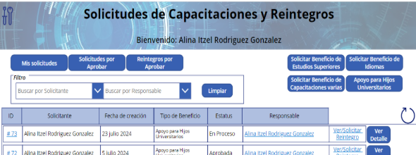
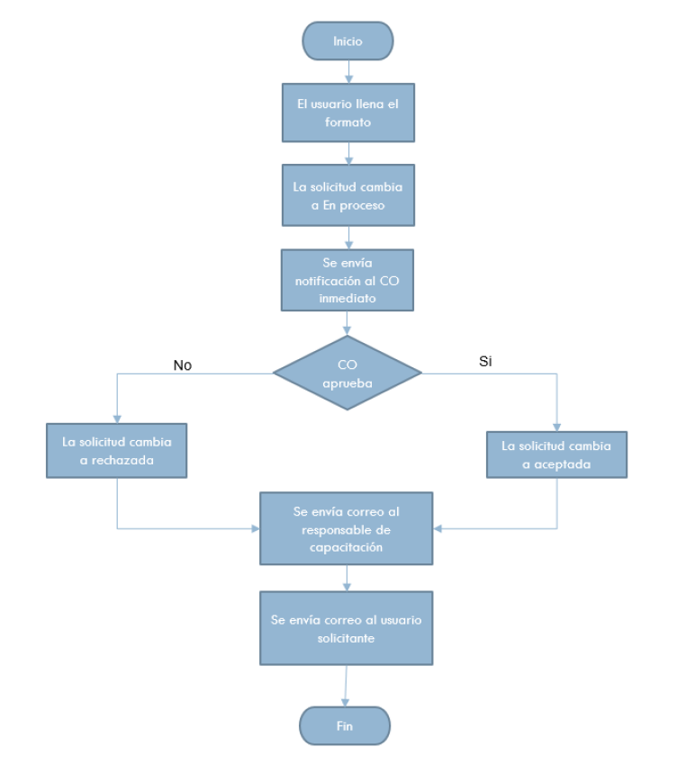
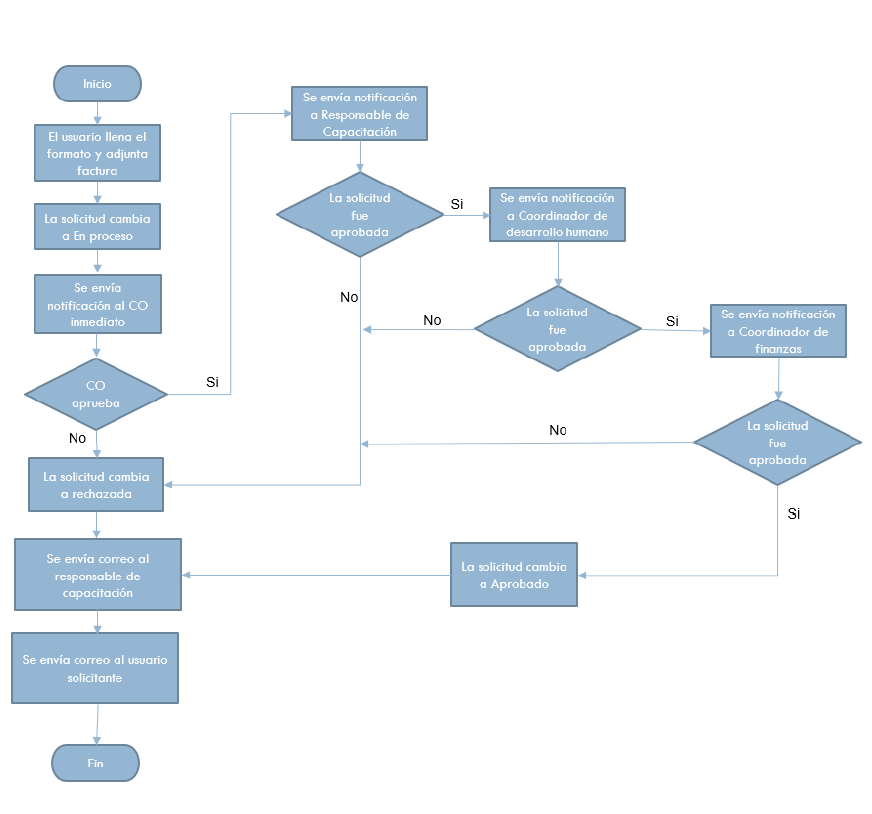
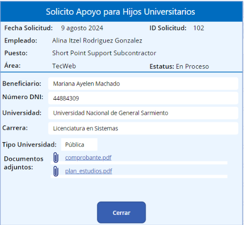
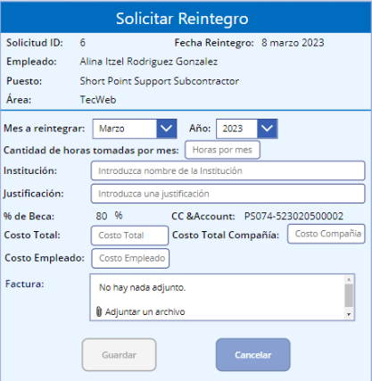
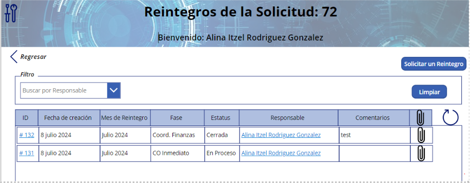

# Employee Training & Reimbursement Automation

## Project Context

This project was developed to digitalize the internal process for managing employee training requests and reimbursement submissions.

The solution supports administrative teams by providing a centralized platform where employees can submit requests, track approvals, and manage reimbursement documentation.

The objective was to replace manual coordination through email and spreadsheets with a structured and traceable workflow.

---

## Business Problem

Many organizations manage employee training requests and reimbursement processes through email, spreadsheets, or informal communication channels.

This creates several operational issues:

- Lack of visibility on request status
- Delays in approval cycles
- Manual tracking of training budgets
- Difficulty maintaining documentation for reimbursements
- Limited traceability for audits

Without a structured system, administrative teams spend significant time coordinating requests and verifying approvals.

---

## Solution Overview

This solution automates the management of employee training requests and reimbursement processes using Microsoft Power Platform.

The system provides a centralized application where employees can submit training requests, track their status, and request reimbursements once the training is completed.

The solution introduces:

- Structured request submission
- Automated approval workflows
- Centralized tracking of requests
- Document management for reimbursement validation
- Role-based access for employees, approvers, and administrators

This approach reduces manual coordination and improves visibility across the process.

---

## Process Flows

### Training Request Approval Flow

Employees submit a training request through the application.  
The request is routed to the appropriate approver for validation before being processed by the administrative team.

The system ensures approvals are registered and traceable.

---

### Reimbursement Request Flow

After completing the training, employees can submit a reimbursement request including supporting documentation.

The system manages the validation and approval process before the reimbursement is processed.

---

## Application Screenshots

### Main Dashboard

Central interface where employees can submit new requests and track their status.

---

### Request Detail

Detailed view displaying request information, status, supporting documentation, and approval history.

---

### Reimbursement Request Form

Form used by employees to submit reimbursement requests associated with approved training activities.

---

### Reimbursement Management

Administrative interface used to monitor and manage reimbursement requests.

---

## User Roles

- **Employees** – Submit training and reimbursement requests  
- **Approvers** – Review and approve requests  
- **Administrators** – Monitor and manage all requests in the system  

---

## Key Features

- Training request management
- Reimbursement request tracking
- Structured approval workflow
- Document management for reimbursements
- Status tracking for submitted requests
- Role-based access control
- Centralized request visibility

---

## Process Automation Highlights

The solution introduces several automation improvements:

- Automated routing of training requests for approval
- Structured tracking of reimbursement submissions
- Centralized request monitoring for administrators
- Reduction of manual coordination between departments
- Standardized documentation handling

These improvements streamline the process and increase operational transparency.

---

## Technologies Used

- Microsoft Power Apps (Canvas)
- Power Automate
- SharePoint Online
- Microsoft 365

---

## Business Impact

This solution helps organizations:

- Reduce manual coordination between employees and administrators
- Improve visibility of training requests and reimbursements
- Maintain structured documentation for financial processes
- Ensure traceability for approval and reimbursement workflows

The project demonstrates how low-code platforms can digitize internal operational processes efficiently.
